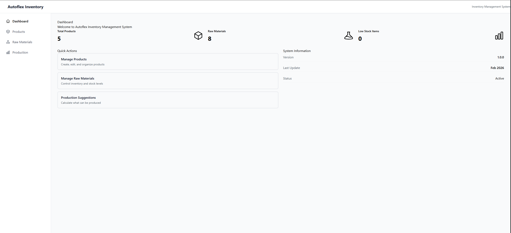
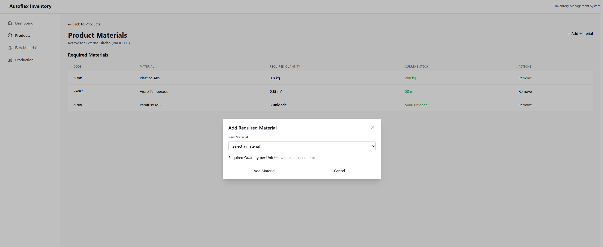
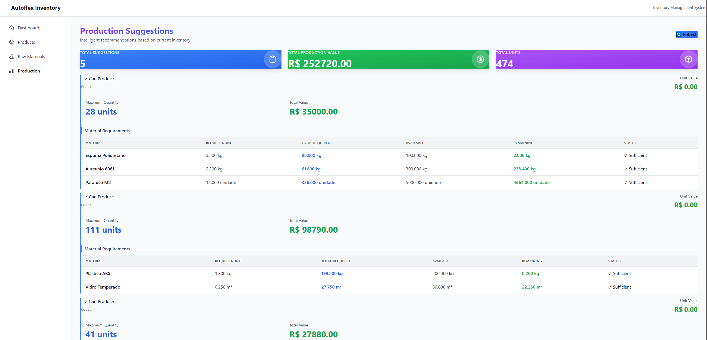

# 🏭 Autoflex Inventory Management System

Sistema completo de gerenciamento de estoque de matérias-primas e sugestão inteligente de produção baseada em disponibilidade e valor dos produtos.

[](https://openjdk.org/)
[](https://spring.io/projects/spring-boot)
[](https://react.dev/)
[](https://www.postgresql.org/)

**🌐 [Demo ao Vivo](https://autoflex-inventory-system.vercel.app)** | **📖 [API Docs](https://autoflex-inventory-system-production.up.railway.app/swagger-ui.html)**

---

## 📋 Sobre o Projeto

Sistema web desenvolvido para controlar o estoque de matérias-primas e calcular automaticamente quais produtos podem ser produzidos com base no estoque disponível, priorizando produtos de maior valor.

**Desenvolvido para:** Teste Prático Autoflex

---

## ✨ Funcionalidades

### Backend (API REST)

- ✅ CRUD completo de **Produtos**
- ✅ CRUD completo de **Matérias-Primas**
- ✅ **Associação Produto-Matéria Prima** com quantidades necessárias
- ✅ **Controle de estoque** com alertas de estoque mínimo
- ✅ **Controle de custos** com registro de custo unitário
- ✅ **Algoritmo inteligente de sugestão de produção**
  - Calcula quantidade máxima produzível baseada no estoque
  - Prioriza produtos de maior valor
  - Identifica materiais limitantes
  - Calcula valor total de produção

### Frontend (React SPA)

- ✅ Interface moderna e responsiva (Tailwind CSS)
- ✅ Gerenciamento de estado com Redux Toolkit
- ✅ Dashboard com estatísticas em tempo real
- ✅ **Gerenciamento de materiais por produto** com interface dedicada
- ✅ Visualização de sugestões de produção com detalhes
- ✅ **Indicadores visuais de estoque** (Low Stock alerts)
- ✅ Notificações toast para feedback do usuário
- ✅ Design moderno com gradientes e cards coloridos

### Qualidade & Segurança

- ✅ Documentação Swagger/OpenAPI interativa
- ✅ Validação de dados (backend e frontend)
- ✅ Tratamento robusto de exceções
- ✅ CORS configurado para produção
- ✅ Código limpo seguindo princípios SOLID

---

## 🛠️ Tecnologias Utilizadas

### Backend

- **Java 17** - Linguagem de programação
- **Spring Boot 3.2.2** - Framework backend
- **Spring Data JPA** - ORM/Persistência
- **PostgreSQL 18** - Banco de dados relacional
- **Maven** - Gerenciamento de dependências
- **Lombok** - Redução de boilerplate
- **Swagger/OpenAPI 3** - Documentação da API

### Frontend

- **React 18** - Biblioteca UI
- **Redux Toolkit** - Gerenciamento de estado
- **React Router 6** - Navegação SPA
- **Axios** - Cliente HTTP
- **Tailwind CSS** - Framework CSS
- **Vite** - Build tool
- **React Toastify** - Notificações

### Deploy

- **Railway** - Backend (PostgreSQL + Spring Boot)
- **Vercel** - Frontend (React)

---

## 🌐 URLs de Produção

- **Frontend:** https://autoflex-inventory-system.vercel.app
- **Backend API:** https://autoflex-inventory-system-production.up.railway.app
- **Swagger UI:** https://autoflex-inventory-system-production.up.railway.app/swagger-ui.html

---

## 📸 Screenshots

### Dashboard

Visão geral do sistema com cards informativos sobre produtos, matérias-primas e produção.



---

### Gestão de Produtos

CRUD completo de produtos com interface moderna. Cada produto possui um botão dedicado para gerenciar suas matérias-primas necessárias.


---

### Gestão de Matérias-Primas

Controle completo de estoque com alertas visuais de estoque baixo (Low Stock). Exibe quantidade em estoque, estoque mínimo e unidade de medida.


---

### Associação de Materiais ao Produto

Interface dedicada para definir quais matérias-primas compõem cada produto e suas respectivas quantidades necessárias por unidade.



---

### Sugestão de Produção

Visualização inteligente com cards coloridos mostrando estatísticas totais e detalhamento completo de cada sugestão de produção, incluindo:

- Quantidade máxima produzível
- Valor total da produção
- Material limitante
- Status de cada matéria-prima (suficiente/insuficiente)



---

## 📦 Pré-requisitos

- Java 17 ou superior
- Node.js 18+ e npm
- PostgreSQL 18+
- Maven 3.8+ (ou usar o wrapper incluído)
- Git

---

## 🚀 Como Executar Localmente

### 1. Clone o repositório

```bash
git clone https://github.com/DiegoRapichan/autoflex-inventory-system.git
cd autoflex-inventory-system
```

### 2. Configure o PostgreSQL

```sql
CREATE DATABASE autoflex;
CREATE USER autoflex WITH PASSWORD 'autoflex123';
GRANT ALL PRIVILEGES ON DATABASE autoflex TO autoflex;
ALTER DATABASE autoflex OWNER TO autoflex;
```

### 3. Execute o Backend

```bash
cd autoflex-backend

# Compilar
./mvnw clean install -DskipTests

# Executar
./mvnw spring-boot:run

# Backend rodará em http://localhost:8080
# Swagger UI: http://localhost:8080/swagger-ui.html
```

### 4. Execute o Frontend

```bash
cd autoflex-frontend

# Instalar dependências
npm install

# Executar
npm run dev

# Frontend rodará em http://localhost:5173
```

---

## 📚 Documentação da API

### Endpoints Principais

**Base URL (Produção):** `https://autoflex-inventory-system-production.up.railway.app/api`  
**Base URL (Local):** `http://localhost:8080/api`

#### Products

```
GET    /products              - Listar todos os produtos
GET    /products/{id}         - Buscar produto por ID
POST   /products              - Criar novo produto
PUT    /products/{id}         - Atualizar produto
DELETE /products/{id}         - Deletar produto
```

#### Raw Materials

```
GET    /raw-materials         - Listar todas as matérias-primas
GET    /raw-materials/{id}    - Buscar matéria-prima por ID
POST   /raw-materials         - Criar nova matéria-prima
PUT    /raw-materials/{id}    - Atualizar matéria-prima
DELETE /raw-materials/{id}    - Deletar matéria-prima
```

#### Product-Raw Materials (Associations)

```
GET    /product-raw-materials/product/{id}  - Listar materiais de um produto
POST   /product-raw-materials               - Associar material a produto
PUT    /product-raw-materials/{id}          - Atualizar associação
DELETE /product-raw-materials/product/{productId}/material/{materialId} - Remover associação
```

#### Production Suggestions

```
GET    /production/suggestions - Calcular sugestões de produção
```

**Documentação Interativa:** [Swagger UI](https://autoflex-inventory-system-production.up.railway.app/swagger-ui.html)

---

## 🗂️ Estrutura do Projeto

```
autoflex-inventory-system/
├── autoflex-backend/
│   ├── src/
│   │   ├── main/
│   │   │   ├── java/com/autoflex/inventory/
│   │   │   │   ├── config/          # Configurações (CORS, Swagger)
│   │   │   │   ├── controller/      # Controllers REST
│   │   │   │   ├── dto/             # Data Transfer Objects
│   │   │   │   ├── entity/          # Entidades JPA
│   │   │   │   ├── exception/       # Exception Handlers
│   │   │   │   ├── repository/      # Repositories
│   │   │   │   └── service/         # Lógica de negócio + Algoritmo
│   │   │   └── resources/
│   │   │       └── application.properties
│   │   └── test/
│   └── pom.xml
│
├── autoflex-frontend/
│   ├── src/
│   │   ├── api/                     # Chamadas API (Axios)
│   │   ├── components/
│   │   │   ├── common/              # Componentes reutilizáveis
│   │   │   └── layout/              # Layout (Header, Sidebar)
│   │   ├── pages/                   # Páginas (Products, Materials, Production)
│   │   ├── store/                   # Redux Store + Slices
│   │   ├── utils/                   # Formatters e utilitários
│   │   └── App.jsx
│   ├── package.json
│   ├── vite.config.js
│   └── tailwind.config.js
│
└── docs/
    └── screenshots/                 # Screenshots do sistema
        ├── dashboard.png
        ├── products.png
        ├── raw-materials.png
        ├── adding-materials.png
        └── production-suggestion.png
```

---

## 💾 Modelo de Dados

### Tabela: `products`

| Campo      | Tipo          | Descrição                 |
| ---------- | ------------- | ------------------------- |
| id         | BIGSERIAL     | Chave primária            |
| code       | VARCHAR(50)   | Código único do produto   |
| name       | VARCHAR(200)  | Nome do produto           |
| value      | NUMERIC(10,2) | Valor unitário do produto |
| created_at | TIMESTAMP     | Data de criação           |
| updated_at | TIMESTAMP     | Data de atualização       |

### Tabela: `raw_materials`

| Campo             | Tipo              | Descrição                      |
| ----------------- | ----------------- | ------------------------------ |
| id                | BIGSERIAL         | Chave primária                 |
| code              | VARCHAR(50)       | Código único do material       |
| name              | VARCHAR(200)      | Nome do material               |
| stock_quantity    | NUMERIC(10,3)     | Quantidade em estoque          |
| **minimum_stock** | **NUMERIC(10,2)** | **Estoque mínimo (alerta)** ⭐ |
| **unit_cost**     | **NUMERIC(10,2)** | **Custo unitário** ⭐          |
| unit              | VARCHAR(20)       | Unidade de medida              |
| created_at        | TIMESTAMP         | Data de criação                |
| updated_at        | TIMESTAMP         | Data de atualização            |

### Tabela: `product_raw_materials`

| Campo             | Tipo          | Descrição                         |
| ----------------- | ------------- | --------------------------------- |
| id                | BIGSERIAL     | Chave primária                    |
| product_id        | BIGINT        | FK para products                  |
| raw_material_id   | BIGINT        | FK para raw_materials             |
| required_quantity | NUMERIC(10,3) | Quantidade necessária por unidade |

**Constraints:**

- UNIQUE (product_id, raw_material_id)
- ON DELETE CASCADE

---

## 🎯 Algoritmo de Sugestão de Produção

O sistema implementa um algoritmo inteligente que:

1. **Busca todos os produtos** ordenados por valor (maior primeiro)
2. **Para cada produto**, calcula a quantidade máxima produzível baseada em:
   - Quantidade disponível de cada matéria-prima
   - Quantidade necessária por unidade de produto
3. **Determina o limitante**: A matéria-prima que permite produzir menos unidades
4. **Calcula o valor total** da produção sugerida
5. **Retorna a lista** ordenada por valor de produção

**Complexidade:** O(n × m) onde n = número de produtos, m = matérias-primas por produto

**Exemplo:**

```
Produto: Cadeira (Valor: R$ 150,00)
Matérias-primas necessárias:
- Madeira: 2.5 KG por unidade | 100 KG em estoque → 40 unidades possíveis
- Parafuso: 8 UN por unidade | 200 UN em estoque → 25 unidades possíveis
- Verniz: 0.3 L por unidade | 5 L em estoque → 16 unidades possíveis

Quantidade máxima produzível = MIN(40, 25, 16) = 16 unidades
Valor total da produção = 16 × R$ 150,00 = R$ 2.400,00
Material limitante: Verniz (estoque baixo)
```

---

## 🧪 Testes

### Backend

```bash
cd autoflex-backend
./mvnw test
```

### Frontend

```bash
cd autoflex-frontend
npm run test
```

---

## 📋 Checklist de Requisitos

### Requisitos Não Funcionais

- [x] RNF001 - Plataforma WEB (Chrome, Firefox, Edge)
- [x] RNF002 - API separada do front-end
- [x] RNF003 - Responsividade
- [x] RNF004 - PostgreSQL
- [x] RNF005 - Framework backend (Spring Boot)
- [x] RNF006 - React + Redux
- [x] RNF007 - Código em inglês

### Requisitos Funcionais

- [x] RF001 - CRUD Produtos (Backend)
- [x] RF002 - CRUD Matérias-Primas (Backend)
- [x] RF003 - CRUD Associações (Backend)
- [x] RF004 - Consulta de Produção (Backend)
- [x] RF005 - Interface CRUD Produtos
- [x] RF006 - Interface CRUD Matérias-Primas
- [x] RF007 - Interface Associações (Página dedicada)
- [x] RF008 - Interface Sugestão de Produção

### Extras Implementados

- [x] **Alerta de estoque mínimo** (minimum_stock)
- [x] **Controle de custo unitário** (unit_cost)
- [x] **Interface de gerenciamento de materiais** por produto
- [x] **Design moderno** com gradientes e animações
- [x] **Badges coloridos** para status de estoque
- [x] **Deploy em produção** (Railway + Vercel)
- [x] **Documentação Swagger** completa
- [x] Testes unitários Backend
- [x] Testes unitários Frontend

---

## 🚀 Deploy

### Backend (Railway)

```bash
# Railway detecta automaticamente o projeto Java
# Configure as variáveis de ambiente:
DATABASE_URL=<postgresql-url>
SPRING_PROFILES_ACTIVE=prod
```

### Frontend (Vercel)

```bash
# Vercel detecta automaticamente o projeto Vite
# Configure as variáveis de ambiente:
VITE_API_URL=https://autoflex-inventory-system-production.up.railway.app/api
```

---

## 👨‍💻 Autor

**Diego Rapichan**

- GitHub: [@DiegoRapichan](https://github.com/DiegoRapichan)
- LinkedIn: [Diego Rapichan](https://linkedin.com/in/diego-rapichan)
- Email: direrapichan@gmail.com

---

## 📝 Licença

Este projeto está sob a licença MIT. Veja o arquivo [LICENSE](LICENSE) para mais detalhes.

---

## 🙏 Agradecimentos

Projeto desenvolvido para o teste prático da **Autoflex**. Agradeço pela oportunidade de demonstrar minhas habilidades técnicas em desenvolvimento full-stack.

---

<div align="center">
  
**⭐ Se este projeto foi útil, considere dar uma estrela!**

Desenvolvido por Diego Rapichan

</div>
