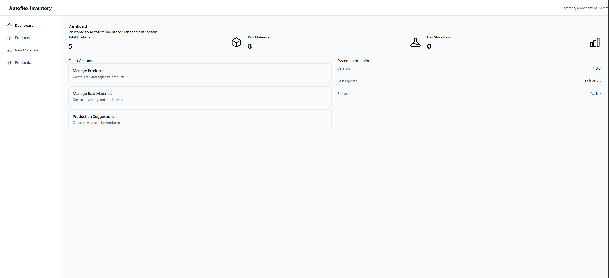
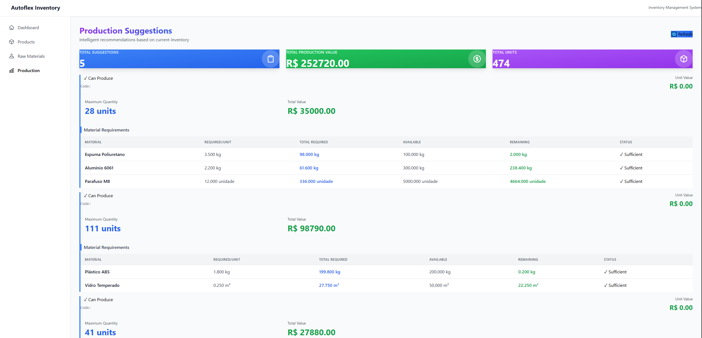
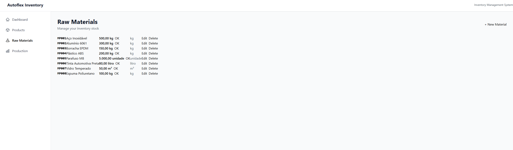

# Autoflex Inventory System 

> Sistema full stack de gestão de estoque e sugestão inteligente de produção — calcula automaticamente quais produtos fabricar com base no estoque disponível de matérias-primas, priorizando os de maior valor agregado.


**[🚀 App ao Vivo](https://autoflex-inventory-system.vercel.app)** • **[📖 Swagger UI](https://autoflex-inventory-system-production.up.railway.app/swagger-ui.html)** • **[🔌 API](https://autoflex-inventory-system-production.up.railway.app/api)**

---

## 🛠️ Stack

| Camada           | Tecnologias                                                                           |
| ---------------- | ------------------------------------------------------------------------------------- |
| **Backend**      | Java 17 · Spring Boot 3.2 · Spring Data JPA · Hibernate · PostgreSQL · Lombok · Maven |
| **Documentação** | Swagger / OpenAPI 3                                                                   |
| **Frontend**     | React 18 · Redux Toolkit · React Router 6 · Axios · Tailwind CSS · Vite               | 
| **Deploy**       | Railway (backend + PostgreSQL) · Vercel (frontend)                                    |

---

## ⚙️ Destaques Técnicos

**Algoritmo de sugestão de produção (`ProductionSuggestionService`)**
Serviço dedicado exclusivamente ao algoritmo, separado do `ProductService`. Produtos chegam ordenados por valor decrescente (`findAllByOrderByValueDesc` — query derivada do Spring Data). Para cada produto, busca as matérias-primas associadas e chama `calculateMaxQuantity`: itera sobre cada `ProductRawMaterial`, divide `availableStock / requiredPerUnit` com `RoundingMode.DOWN` (arredondamento conservador — nunca superestima), e aplica `Math.min` acumulativo para encontrar o limitante. Materiais com estoque zero são capturados separadamente na lista `missingMaterials`. A resposta inclui `totalRequired`, `remainingStock` e `sufficient` por material — o frontend exibe o detalhamento completo sem fazer nenhum cálculo.

**`CalculationResult` como classe interna de retorno**
O método privado `calculateMaxQuantity` retorna um record auxiliar (`CalculationResult`) encapsulando `maxQuantity` + `missingMaterials` — evita múltiplos retornos ou parâmetros de saída, padrão limpo para métodos com múltiplos resultados relacionados.

**Totalizadores e warnings gerados no backend**
`ProductionResponseDTO` inclui `totalProductionValue`, `totalUnits`, `totalProductTypes` e `warnings` — calculados no serviço com streams. Produtos sem matérias-primas cadastradas são detectados e retornam sugestão vazia com razão descritiva, sem quebrar o fluxo.

**Hierarquia de exceções customizada**
`ResourceNotFoundException` (404) e `BusinessException` (400) tratadas globalmente via `@ControllerAdvice` — respostas de erro padronizadas em toda a API sem try/catch nos controllers.

**Validação de unicidade sem busca desnecessária**
`productRepository.existsByCode(code)` antes de criar ou atualizar — verifica duplicidade com query `EXISTS` sem carregar o objeto inteiro. Em atualização, só valida o novo código se ele foi efetivamente alterado.

**`@Transactional(readOnly = true)` em todas as queries de leitura**
Incluindo `calculateProductionSuggestions` — o Hibernate não abre sessão de escrita, o banco pode aplicar otimizações de read-only. Detalhe que separa quem entende JPA de quem apenas usa o framework.

**DTOs separados das entidades JPA**
`toDTOWithMaterials` só é chamado quando o frontend precisa da lista completa — listagens gerais não fazem join desnecessário. O modelo de banco nunca é exposto diretamente na API.

**Gerenciamento de estado com Redux Toolkit**
Slices separados para produtos, matérias-primas e sugestões de produção. Actions assíncronas com `createAsyncThunk`. Estado de loading e erro tratados globalmente.

---

## 📸 Screenshots

**Dashboard**


**Sugestão de Produção**


**Gestão de Matérias-Primas**


---

## 🎯 Algoritmo de Sugestão de Produção

O `ProductionSuggestionService` implementa o algoritmo em método privado `calculateMaxQuantity`:

```java
// Para cada matéria-prima do produto:
int possibleUnits = availableStock
    .divide(requiredPerUnit, 0, RoundingMode.DOWN) // conservador: arredonda pra baixo
    .intValue();

maxQuantity = Math.min(maxQuantity, possibleUnits); // acumula o limitante
```

Materiais com `stockQuantity == 0` são capturados em `missingMaterials` e não interrompem o cálculo dos demais. A resposta inclui `remainingStock` por material (quanto sobra após produção), `totalRequired` (quantidade total consumida) e `sufficient` — o frontend recebe tudo calculado, sem lógica no cliente.

**Exemplo real com resposta completa:**

```
Produto: Cadeira de Madeira  |  Valor: R$ 150,00

Material   | Estoque  | Necessário/un | Possível  | Total usado | Restante
-----------+----------+---------------+-----------+-------------+---------
Madeira    | 100 KG   | 2,5 KG        | 40 un     | 40,0 KG     | 60,0 KG
Parafuso   | 200 UN   | 8 UN          | 25 un     | 128 UN      | 72 UN
Verniz     | 5 L      | 0,3 L         | 16 un ← LIMITANTE | 4,8 L | 0,2 L

maxQuantity = MIN(40, 25, 16) = 16 unidades
totalValue  = 16 × R$ 150,00 = R$ 2.400,00
```

A resposta do endpoint `/production/suggestions` também inclui totalizadores globais: `totalProductionValue`, `totalUnits`, `totalProductTypes` e `warnings` (ex: produtos sem matérias-primas configuradas).

---

## 🗄️ Modelo de Dados

```
products
  id · code (UNIQUE) · name · value · created_at · updated_at

raw_materials
  id · code (UNIQUE) · name · stock_quantity · minimum_stock
  unit_cost · unit · created_at · updated_at

product_raw_materials
  id · product_id (FK) · raw_material_id (FK) · required_quantity
  UNIQUE(product_id, raw_material_id) · ON DELETE CASCADE
```

---

## ✨ Funcionalidades

**Backend — API REST**

- CRUD completo de Produtos e Matérias-Primas
- Associação Produto ↔ Matéria-Prima com quantidade necessária por unidade
- Controle de estoque com alertas de estoque mínimo configurável
- Registro de custo unitário por material
- Endpoint de sugestão de produção com algoritmo de priorização por valor
- Documentação Swagger/OpenAPI 3 interativa
- Tratamento global de exceções com `@ControllerAdvice`
- CORS configurado para produção

**Frontend — React SPA**

- Dashboard com estatísticas em tempo real
- CRUD de produtos e matérias-primas com validação client-side
- Interface dedicada para associar matérias-primas a cada produto
- Página de sugestão de produção com cards detalhados por produto
- Badges visuais de status de estoque (normal / atenção / crítico)
- Gerenciamento de estado com Redux Toolkit
- Notificações toast para feedback de ações
- Design responsivo com Tailwind CSS

---

## 🔌 Endpoints da API

```
Base URL produção: https://autoflex-inventory-system-production.up.railway.app/api

# Produtos
GET    /products              Lista todos os produtos
GET    /products/{id}         Busca produto por ID
POST   /products              Cria novo produto
PUT    /products/{id}         Atualiza produto
DELETE /products/{id}         Remove produto

# Matérias-Primas
GET    /raw-materials          Lista todas as matérias-primas
GET    /raw-materials/{id}     Busca por ID
POST   /raw-materials          Cria nova matéria-prima
PUT    /raw-materials/{id}     Atualiza matéria-prima
DELETE /raw-materials/{id}     Remove matéria-prima

# Associações Produto ↔ Material
GET    /product-raw-materials/product/{id}                       Lista materiais de um produto
POST   /product-raw-materials                                    Associa material a produto
PUT    /product-raw-materials/{id}                               Atualiza quantidade necessária
DELETE /product-raw-materials/product/{pId}/material/{mId}       Remove associação

# Produção
GET    /production/suggestions   Calcula e retorna sugestões de produção ordenadas por valor
```

Documentação interativa completa: **[Swagger UI](https://autoflex-inventory-system-production.up.railway.app/swagger-ui.html)**

---

## 📁 Estrutura do Projeto

```
autoflex-inventory-system/
├── autoflex-backend/
│   └── src/main/java/com/autoflex/inventory/
│       ├── config/          # CORS, Swagger/OpenAPI
│       ├── controller/      # ProductController, RawMaterialController,
│       │                    # ProductRawMaterialController, ProductionController
│       ├── dto/             # Request/Response DTOs (separados das entidades)
│       ├── entity/          # Product, RawMaterial, ProductRawMaterial (JPA)
│       ├── exception/       # GlobalExceptionHandler (@ControllerAdvice)
│       ├── repository/      # Spring Data JPA Repositories
│       └── service/         # Lógica de negócio + Algoritmo de produção
│
└── autoflex-frontend/
    └── src/
        ├── api/             # Clientes Axios por recurso
        ├── components/
        │   ├── common/      # Componentes reutilizáveis (badges, modais, tabelas)
        │   └── layout/      # Header, Sidebar
        ├── pages/           # Dashboard, Products, RawMaterials, Production
        ├── store/           # Redux Store + Slices (products, materials, production)
        └── utils/           # Formatters (moeda, data, unidade)
```

---

## 🚀 Como Rodar Localmente

**Pré-requisitos:** Java 17+, Node.js 18+, PostgreSQL, Maven 3.8+

```bash
# 1. Clone
git clone https://github.com/DiegoRapichan/autoflex-inventory-system.git
cd autoflex-inventory-system

# 2. Banco de dados
psql -U postgres -c "CREATE DATABASE autoflex;"

# 3. Backend
cd autoflex-backend
# Configure src/main/resources/application.properties:
# spring.datasource.url=jdbc:postgresql://localhost:5432/autoflex
# spring.datasource.username=seu_usuario
# spring.datasource.password=sua_senha

./mvnw spring-boot:run
# API em http://localhost:8080
# Swagger em http://localhost:8080/swagger-ui.html

# 4. Frontend (novo terminal)
cd ../autoflex-frontend
npm install
# Configure .env:
# VITE_API_URL=http://localhost:8080/api
npm run dev
# App em http://localhost:5173
```

---

## 🌐 Deploy

| Serviço        | URL                                                                         |
| -------------- | --------------------------------------------------------------------------- |
| Frontend       | https://autoflex-inventory-system.vercel.app                                |
| Backend API    | https://autoflex-inventory-system-production.up.railway.app/api             |
| Swagger UI     | https://autoflex-inventory-system-production.up.railway.app/swagger-ui.html |
| Banco de dados | PostgreSQL via Railway                                                      |

---

## 👨‍💻 Autor

**Diego Rapichan** — Desenvolvedor Full Stack · Java/Spring Boot + Node.js + React

[](https://linkedin.com/in/diego-rapichan)
[](https://github.com/DiegoRapichan)

📍 Apucarana, Paraná — Brasil

---

📄 Licença MIT
